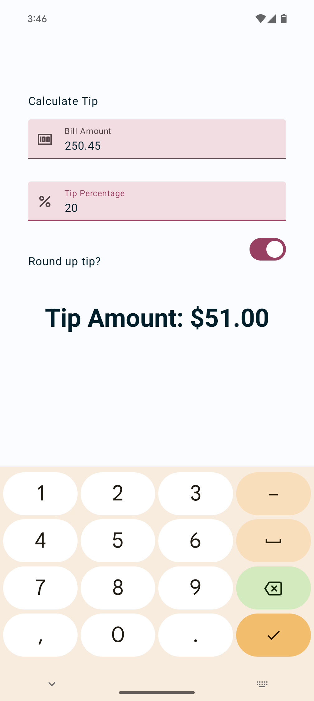

Tip Calculator
=================================

Starter code for the [Android Basics with Compose](https://developer.android.com/courses/android-basics-compose/course): Tip Calculator app.

Introduction
------------
The Tip Calculator app contains various UI elements for calculating a tip,
teaching about user input, and State in Compose.

Screenshot
------------

Pre-requisites
--------------
* Experience with Kotlin syntax.
* How to create and run a project in Android Studio.

Getting Started
---------------
1. Install Android Studio, if you don't already have it.
2. Download the sample.
3. Import the sample into Android Studio.
4. Build and run the sample.

Authors
---------------
- **Yuji RZA** - [uitangclan](https://github.com/uitangclan)